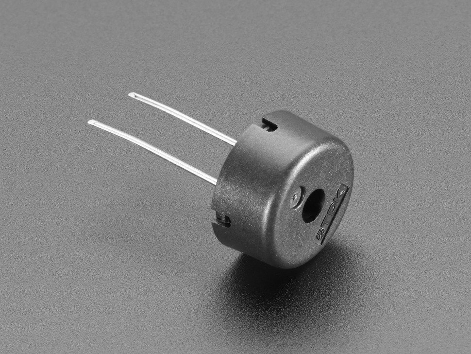

# Firmware Training Session 2
In this session, we'll learn how I2C protocol functions, develop a 
library for the Haptic Driver on the training board, and use it to interface
 with the Piezo buzzer onboard.

 ## Piezo Buzzer
Piezo Buzzer are used for making beeps, tones and alerts, they look like this on your board.

Piezo Buzzer utlises the effect called "Piezoelectric effect". In casual words it means: if you squeeze them, you can make electricity flow through them. The reverse also applies: if electricity flows through, they will squeeze themselves.
Which means, if you apply voltage and then let go of the voltage, it will essentially vibrates and create sound.

