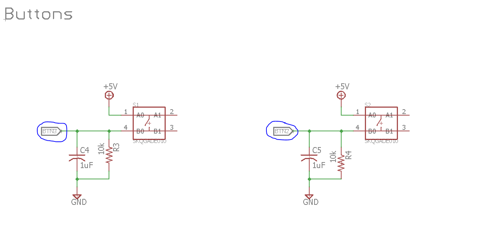
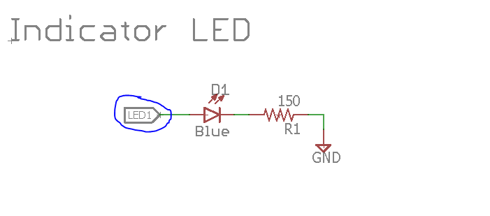
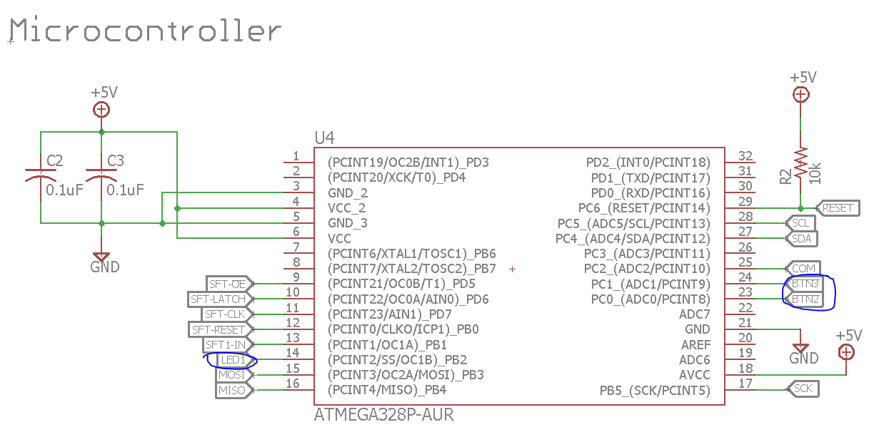
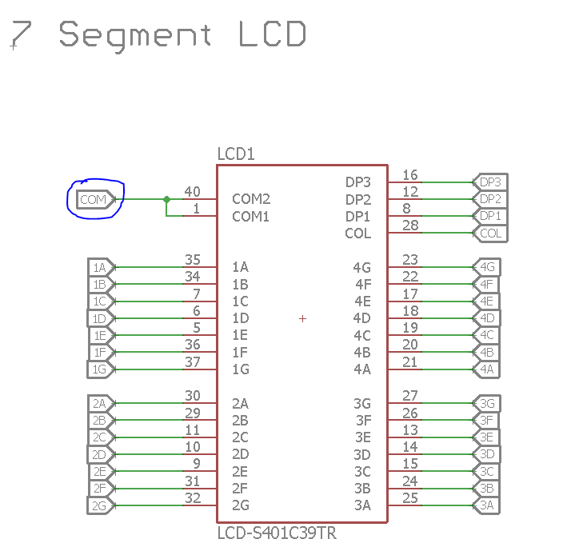

# Firmware Training Session #1
In this session, we will use the Arduino IDE for basic GPIO operations,
introduce pulse width modulation (PWM), and develop a firmware library for
interfacing with the shift registers and LCD on the training board.

## Setup
Install the Arduino IDE from 
[Arduino website](https://www.arduino.cc/en/Main/Software).

If you're running Windows, please install the USBtinyISP drivers from
Adafruit's website [here](https://learn.adafruit.com/usbtinyisp/drivers). These
drivers enable use of the Tiny AVR Programmer, which permits you to program your
board.

Our board uses a custom configuration, which is different from the standard
Arduino layout. We will therefore need to configure individual settings for
programming the ATMega328 chip. To do so, we will load in the MiniCore package:
1. Open the Arduino IDE
2. Go to **File > Preference**. Paste 
`https://mcudude.github.io/MiniCore/package_MCUdude_MiniCore_index.json` 
into **Additional Boards Manager URLs** and press **OK**
3. Go to **Tools > Board > Boards Manager** and search for and install 
`MiniCore`
4. Go to **Tools > Programmer** and select *USBtinyISP* as your programmer
5. Go to **Tools** and set the following settings:

| Parameter | Value |
|---|---|
| Board | *(MiniCore)* ATmega328 |
| Variant | 328p/ 328pa |
| BOD | 2.7V |
| Clock | 1 MHz Internal |
| Compiler LTO | Disabled |

Congratulations, we're now ready to get started!

## Basics
We will now explore different methods of interfacing with the ATmega328
microcontroller throught the Arduino IDE.

Generally, Arduino programs consist of a `setup()` functions, which run once,
and a `loop()` funciton, which continuously repeats.

### Blinky
In this section, we construct a program to interface with the onboard buttons
and LED. 

Begin a new sketch by opening the Arduino IDE and clicking **File > New**

A new window will appear with the following skeleton code:
```C
void setup() {
  // put your setup code here, to run once:

}

void loop() {
  // put your main code here, to run repeatedly:

}
```

We begin by setting the proper pin inputs into the MCU. We assign variables
`btn2`, `btn3`, and `led` to their corresponding connections, as can be
determined from the Eagle schematic. 

The buttons are connected pulled down, with an active high input into the MCU:


Likewise, the LED is connected to the MCU in a typical fashion:


These connections are then found on the actual ATmega schematic:


In order to retrieve the pin names as used in Arduino, we reference an ATmega328
pinout: 

Cross-referencing our schematic with the pinout diagram, we find that our pins
have the following Arduino labels:

| Pin | Arduino Label |
| --- | --- |
| btn2 | A0 |
| btn3 | A1 |
| led | 10 |

Therefore, we insert constant definitions for the three pins in above 
`void setup() ...`:

```C
// Pin definitions
const int btn2 = A0;
const int btn3 = A1;
const int led  = 10;
```

In this program, we will read the values of both buttons. When no buttons are
pressed, the LED will be off. When one is pressed, the LED will be on. When both
buttons are pressed, the LED will flicker at a fast rate.

In order to be able to toggle the LED and to maintain cleaner code, we will have
an `ledState` variable that will keep track of whether the LED is on or off. By
setting this variable, we will be able to activate and deactivate the LED as
desired on every loop.

We thus declare and initialize an LED integer below the pin definitions:
```C
// Keep track of whether the LED is on or off at the present moment
int ledState = 0;
```

Next, we configure each of the pins as an input or output using Arduino's
`pinMode(..)` function. Each of these three statements goes in the setup()
function, which sets the direction of each of the pins:

```C
void setup() {
  // Set inputs and outputs
  pinMode(btn2, INPUT);
  pinMode(btn3, INPUT);
  pinMode(led, OUTPUT);
}
```
We're now ready to implement the actual program logic. This code goes in the
`void loop()` event loop, where it will read the inputs and update the outputs
in each cycle. We use the `digitalRead(..)` functions to read the values from
the digtial inputs, and based on these readings update the `ledState`.

Insert the following conditional logic into `loop()`:

```C
if (digitalRead(btn2) && digitalRead(btn3))
  ledState = !ledState;
// If either button is pressed, turn LED on
else if (digitalRead(btn2) || digitalRead(btn3))
  ledState = 1;
// If both buttons pressed, blink the LED
// Otherwise, turn LED off
else
  ledState = 0;
```

We then write the `ledState` to the LED pin and use the `delay(..)` function to
stall the program for 50 milliseconds:

```C
digitalWrite(led, ledState);
delay(50);
```

Ultimately, the program will look as follows:

```C
// Pin definitions
const int btn2 = A0;
const int btn3 = A1;
const int led  = 10;

// Keep track of whether the LED is on or off at the present moment
int ledState = 0;

void setup() {
  // Set inputs and outputs
  pinMode(btn2, INPUT);
  pinMode(btn3, INPUT);
  pinMode(led, OUTPUT);
}

void loop() {
  // If both buttons pressed, blink the LED
  if (digitalRead(btn2) && digitalRead(btn3))
    ledState = !ledState;
  // If either button is pressed, turn LED on
  else if (digitalRead(btn2) || digitalRead(btn3))
    ledState = 1;
  // Otherwise, turn LED off
  else
    ledState = 0;

  digitalWrite(led, ledState);
  delay(50);
}
```

Upload to the Arduino by clicking on **Sketch > Upload Using Programmer**, and
observe how pressing the buttons changes the LED output.

### PWM
We will now use pulse width modulation to control the brightness of the LED. PWM
works by outputting a square wave at a set frequency, while varying its duty
cycle (the ratio of the time the wave is HIGH to the total period of the
waveform). An example of PWM waveforms at different duty cycles is shown below:


Arduino supports a PWM resolution of 8 bits. To output a PWM signal from a
pin, begin by setting the pin to output with `pinMode( <PIN_NAME>, OUTPUT )`
and use the `analogWrite(..)` function:
`analogWrite( <PIN_NAME>, <VALUE_BETWEEN_0_AND_255> )`

We show this by creating a new Arduino project called *pwm*, where we use button
*btn2* and the LED to toggle the LED between being off and on at brightness
specified by the PWM duty cycle. The LED output will toggle on each button
press.

First, we define the button and LED pins above `void setup()`:
```C
// Pin definitions
const int btn2 = A0;
const int led  = 10;
```

We will keep track of whether the LED is toggled on or off by using the 
`pwmState` variable:

```C
// Keep track of whether PWM is enabled or disabled
int pwmState = 0;
```

In order to determine when the button is pressed, we will monitor the state of
the button on every clock cyle. 

```C
// Keep track of the current and previous state of the button
int buttonState, buttonStateOld;
```

Finally, we set a constant duty cycle we wish to output to the PWM:

```C
// Duty cycle to write to the LED
const int dutyCycle = 200;
```

We now enter the `setup()` function, where we set the button to an input and the
LED to an output.

```C
void setup() {
  // Set inputs and outputs
  pinMode(btn2, INPUT);
  pinMode(led, OUTPUT);
```
We also initialize the old button state by doing a preliminary reading of the
pushbutton:

```C
  // Initialize the old reading of the button before entering main loop
  buttonStateOld = digitalRead(btn2);
}
```

We are now ready to enter the event loop. We begin by reading the current state
of the button:

```C
void loop() {
  // Read the new button input
  buttonState = digitalRead(btn2);
```

We then check if the button is different from its previous state. If so, we
toggle the `pwmState` variable:

```C
  // If a change is detected in the button, then toggle the PWM state
  if (!buttonStateOld && buttonState)
    pwmState = !pwmState;
```

We then update the old button state, so that the loop can compare with the
current button value:

```C
  // Update the old button state
  buttonStateOld = buttonState;
```

Finally, depending on whether `pwmState` is toggled or not, we write either
`dutyCycle` or `0` to the PWM:

```C

  // Depending on PWM state, output either a PWM at the duty cycle or 0
  if (pwmState)
    analogWrite(led, dutyCycle);
  else
    analogWrite(led, 0);
  
  delay(20);
}
```
Your overall code should look like so:

```C
// Pin definitions
const int btn2 = A0;
const int led  = 10;

// Keep track of whether PWM is enabled or disabled
int pwmState = 0;

// Keep track of the current and previous state of the button
int buttonState, buttonStateOld;

// Duty cycle to write to the LED
const int dutyCycle = 200;

void setup() {
  // Set inputs and outputs
  pinMode(btn2, INPUT);
  pinMode(led, OUTPUT);
  
  // Initialize the old reading of the button before entering main loop
  buttonStateOld = digitalRead(btn2);
}

void loop() {
  // Read the new button input
  buttonState = digitalRead(btn2);

  // If a change is detected in the button, then toggle the PWM state
  if (!buttonStateOld && buttonState)
    pwmState = !pwmState;

  // Update the old button state
  buttonStateOld = buttonState;

  // Depending on PWM state, output either a PWM at the duty cycle or 0
  if (pwmState)
    analogWrite(led, dutyCycle);
  else
    analogWrite(led, 0);

  delay(20);
}
```

Your button should now toggle every time it is presses. Experiment with changing
the button brightness by changing the `dutyCycle` value.


## LCD Library

We can now piece together these concepts into creating more sophisticated
controllers for various components. In this section, we will create a firmware
library for the on-board four digit, seven segment LCD circuit. We wish to
create code for a flexible controller, that can be reused even as the
implementation and use cases change. We will hence create a library four our
LCD, which will then be imported into an Arduino sketch we use to program the
board.

Our LCD contains a pin for each LCD segment on the display, which turns dark
once the pin receives a HIGH signal. To see the pinout, we reference our EAGLE
schematic:


Because the number of pins to control is rather high, we use shift registers to 
interface with nearly all pins on the LCD. The only exception is the `com` pin,
which will be grounded in this tutorial.

We used 74HC595 shift registers, each of which contains a *DS* data input line,
*SHCP* clock line, *STCP* latch line, *MR_n* reset line, which causes a shift
register reset when pulled low, and *OE_n* line, which allows the shift register
to output values when it is pulled low. The shift registers also contain outputs
*Q0..7* and an additional output *Q7S* for feeding the output of one shift
register into another. For additional details regarding the device, please see
its datasheet [here](http://www.ti.com/lit/ds/symlink/sn74hc595.pdf).

The chip register functions by feeding the next bit to be shifted in into the
`data` line. On every rising edge of `clock`, the position of each bit in the
register is incremented by 1, with the current `data` bit moving into *Q0*. In 
our design, we connect for of the shift registers together, such that toggling
the clock more than eight times simply feeds the upper bit into the lower bit of
the next register:


Once all bits have been shifted in, we toggle the `latch` pin in order to output
the bits to the actual pins of the chip. Toggling `reset_n` on a `clock` rising
edge sets all registers to LOW. `oe_n` will dictate whether the shift register
will output its internal values; since we will constantly wish to do so, we will
always drive the pins LOW.


### Header file
We begin by creating the **library header**, where we will **declare** our LED 
object and all of its functionality. In the next section, we will implement the
actual source file, where we will **define** all of the actual functionality of
the LCD object.

Create a new directory *LCD*, and open a new file, *LCD.h*, in your favorite
text editor. At the top of the file, include the compiler directives:
```cpp
#ifndef LCD_H_
#define LCD_H_
```

Similarly, include the compiler directive
```cpp
#endif /* LCD_H_ */
```
at the end of the file. Your code will go between these directives; including
them will make sure that redundant declarations will not occur in your final
sketch. Otherwise, conflicts could occur if your were to, for example, import
both this header and another library dependant on this header into the same
sketch.

Inside of these directives, we will create the `LCD` class. This class will
contain all information and functionality necessary for the LCD's operation.

```cpp
class LCD
{
    /* Your declarations will go here *?
};
```

The class will contain **public** and **private** members; the former will be
accessible by the user that instantiates this class, whereas the latter will
only be accessible by the member functions inside the class itself.

We will keep the pin numbers corresponding to every signal private; to do so,
we declare them as follows inside of the class:

```cpp
    private:
        // Pins connecting to shift registers and LCD
        int com, oe_n, latch, clk, reset_n, data;
```
We now declare our public methods, which can be directly called by the user.

We begin with the constructors, which are invoked once the class is created. We
declare a *default constructor*, which creates the object with default pin
values, as specified in our schematic, and a regular constructor, which obtains
a number for each pin required for controllingt the LCD:


```cpp
    public:
        // Default constructor
        LCD();
        // Constructor for LCD
        LCD(int, int, int, int, int, int);
```

We then declare functions for interfacing with the LCD. For clearing all values,
we declare the `clear()` member function:

```cpp
        // Set all shift register values to 0
        void clear();
```

And for sending a digit to the shift register, we declare a `sendDigit(int)`
member function:
```cpp
        // Send encoding for one digit to the LCD
        void sendDigit(int);
```

To actually write and display digits on the LCD, we declare the
`writeDigit(int)` and `writeTwoDigits(int, int)` member functions. These will
use both `clear()` and `sendDigit()`:

```cpp
        // Clear the LCD and display one digit
        void writeDigit(int);
        // Clear the LCD and display two digits
        void writeTwoDigits(int, int);
```

We lastly declare several utility functions. `getBits(int)` will take in an
integer and return the shift register encoding for its digit, and `clkTick()` 
and `latchTick()` will give a rising edge to either the `clk` or `latch` pin,
respectively:

```cpp
        // Get the encoding for a digit between 0 and 9
        int getBits(int);

        // Utility to tick once
        void clkTick();
        void latchTick();
```

Finally, we declare some useful constants: `BITS_PER_DIGIT` will contain the
number of bits required to define a digit. `TOTAL_BITS` signifies the total
number of bits in all four shift registers. `DELAY_HALF_PERIOD` signifies the 
half-period of each clock cycle.

```cpp
        const int BITS_PER_DIGIT = 8;
        const int TOTAL_BITS = 4 * BITS_PER_DIGIT;
        const int DELAY_HALF_PERIOD = 10;
```

Overall, your header file should look as follows:

```cpp
#ifndef LCD_H_
#define LCD_H_

class LCD {
    public:
        // Default constructor
        LCD();
        // Constructor for LCD
        LCD(int, int, int, int, int, int);
        
        // Set all shift register values to 0
        void clear();
        // Send encoding for one digit to the LCD
        void sendDigit(int);

        // Clear the LCD and display one digit
        void writeDigit(int);
        // Clear the LCD and display two digits
        void writeTwoDigits(int, int);

        // Get the encoding for a digit between 0 and 9
        int getBits(int);

        // Utility to tick once
        void clkTick();
        void latchTick();

        const int BITS_PER_DIGIT = 8;
        const int TOTAL_BITS = 4 * BITS_PER_DIGIT;
        const int DELAY_HALF_PERIOD = 10;

    private:
        // Pins connecting to shift registers and LCD
        int com, oe_n, latch, clk, reset_n, data;
};
#endif /* LCD_H_ */
```

### Source file

In the same directory, we create the header file, *LCD.cpp*

At the top of the file, include the standard Arduino library, which gives us
access to functions such as `digitalOut()`, `delay()`, etc.
We then include the header file we have just created:

```cpp
#include <Arduino.h>

#include "lcd.h"
```

We then create the default and regular constructors. These assign the pins for
controlling the LCD, set all of them to OUTPUTs, and initialize the `com`,
`latch`, and `oe_n` values:

```cpp
LCD::LCD()
{
    com = A2;
    oe_n = 5;
    latch = 6;
    clk = 7;
    reset_n = 8;
    data = 9;

    pinMode(com, OUTPUT);
    pinMode(oe_n, OUTPUT);
    pinMode(latch, OUTPUT);
    pinMode(clk, OUTPUT);
    pinMode(reset_n, OUTPUT);
    pinMode(data, OUTPUT);

    digitalWrite(com, LOW);

    digitalWrite(latch, LOW);
    digitalWrite(oe_n, LOW);
}

LCD::LCD(int com_i, int oe_n_i, int latch_i, int clk_i, 
        int reset_n_i, int data_i)
{
    com = com_i;
    oe_n = oe_n_i;
    latch = latch_i;
    clk = clk_i;
    reset_n = reset_n_i;
    data = data_i;

    pinMode(com, OUTPUT);
    pinMode(oe_n, OUTPUT);
    pinMode(latch, OUTPUT);
    pinMode(clk, OUTPUT);
    pinMode(reset_n, OUTPUT);
    pinMode(data, OUTPUT);

    digitalWrite(com, LOW);

    digitalWrite(latch, LOW);
    digitalWrite(oe_n, LOW);
}
```

We next define the `clkTick()` and `latchTick()` utilities. These will set their
respective signal line to LOW, then delay for half a period, flip it to HIGH,
delay, and then set the pin back to LOW. 

```cpp
// Tick the clock a single time
void LCD::clkTick()
{
    digitalWrite(clk, LOW);
    delay(DELAY_HALF_PERIOD);
    digitalWrite(clk, HIGH);
    delay(DELAY_HALF_PERIOD);
    digitalWrite(clk, LOW);
}

// Tick the latch a single time
void LCD::latchTick()
{
    digitalWrite(latch, LOW);
    delay(DELAY_HALF_PERIOD);
    digitalWrite(latch, HIGH);
    delay(DELAY_HALF_PERIOD);
    digitalWrite(latch, LOW);
}
```

Next, we define the `getBits()` function, which receives an integer input for
a digit and spits out its encoding. These encodings were pre-determined.
```cpp
// Convert digit into bitwise encoding
int LCD::getBits(int digit)
{
    /*
     * We encode digits in 
     *     [ A | B | C | D | E | F | G | DP/Col ] 
     * format
     */
    switch (digit) {
        case 0:
            return 0xFC;
        case 1:
            return 0x60;
        case 2:
            return 0xDA;
        case 3:
            return 0xF2;
        case 4:
            return 0x66;
        case 5:
            return 0xB6;
        case 6:
            return 0xBE;
        case 7:
            return 0xE0;
        case 8:
            return 0xFE;
        case 9:
            return 0xF6;
        default:
            return 0x00;
    }
}
```

We now implement the `clear()` member function. This drives the reset line,
ticks the clock, and latches this into the output pins:

```cpp
void LCD::clear()
{
    digitalWrite(reset_n, LOW);
    clkTick();        
    digitalWrite(reset_n, HIGH);

    latchTick();
}
```
For the `sendDigit()` function, we turn off the latch signal, 
input a digit and retrieve its encoded 
representation, and turn off any resets which may be occurring:

```cpp
void LCD::sendDigit(int digit)
{
    digitalWrite(latch, LOW);

    int digitBits = getBits(digit);

    digitalWrite(reset_n, HIGH);
```

We then clock in 8 bytes into the shift register, shifting the encoded value
right each time so as to receive the next bit:
```cpp
    for (int i=0; i<BITS_PER_DIGIT; ++i) {
        digitalWrite(data, digitBits & 0x1);
        clkTick();
        digitBits >>= 1;
    }
}
```

Lastly, we imlement the `writeDigit()` and `writeTwoDigits()` functions.
For `writeDigit()`, we clear the contents of the LCD, clock in the digit into
the shift register, and latch the new values into the output:

```cpp
void LCD::writeDigit(int digit)
{
    clear();
    sendDigit(digit);
    
    latchTick();
}
```

We do the same for writing two digits, just perform the clocking-in operation
twice:

```cpp
void LCD::writeTwoDigits(int digit1, int digit2)
{
    clear();
    sendDigit(digit1);
    sendDigit(digit2);
    
    latchTick();
}
```

In overall, the source file should be as follows:

```cpp
#include <Arduino.h>

#include "lcd.h"

LCD::LCD()
{
    com = A2;
    oe_n = 5;
    latch = 6;
    clk = 7;
    reset_n = 8;
    data = 9;

    pinMode(com, OUTPUT);
    pinMode(oe_n, OUTPUT);
    pinMode(latch, OUTPUT);
    pinMode(clk, OUTPUT);
    pinMode(reset_n, OUTPUT);
    pinMode(data, OUTPUT);

    digitalWrite(com, LOW);

    digitalWrite(latch, LOW);
    digitalWrite(oe_n, LOW);
}

LCD::LCD(int com_i, int oe_n_i, int latch_i, int clk_i, 
        int reset_n_i, int data_i)
{
    com = com_i;
    oe_n = oe_n_i;
    latch = latch_i;
    clk = clk_i;
    reset_n = reset_n_i;
    data = data_i;

    pinMode(com, OUTPUT);
    pinMode(oe_n, OUTPUT);
    pinMode(latch, OUTPUT);
    pinMode(clk, OUTPUT);
    pinMode(reset_n, OUTPUT);
    pinMode(data, OUTPUT);

    digitalWrite(com, LOW);

    digitalWrite(latch, LOW);
    digitalWrite(oe_n, LOW);
}

// Tick the clock a single time
void LCD::clkTick()
{
    digitalWrite(clk, LOW);
    delay(DELAY_HALF_PERIOD);
    digitalWrite(clk, HIGH);
    delay(DELAY_HALF_PERIOD);
    digitalWrite(clk, LOW);
}

// Tick the latch a single time
void LCD::latchTick()
{
    digitalWrite(latch, LOW);
    delay(DELAY_HALF_PERIOD);
    digitalWrite(latch, HIGH);
    delay(DELAY_HALF_PERIOD);
    digitalWrite(latch, LOW);
}

// Convert digit into bitwise encoding
int LCD::getBits(int digit)
{
    /*
     * We encode digits in 
     *     [ A | B | C | D | E | F | G | DP/Col ] 
     * format
     */
    switch (digit) {
        case 0:
            return 0xFC;
        case 1:
            return 0x60;
        case 2:
            return 0xDA;
        case 3:
            return 0xF2;
        case 4:
            return 0x66;
        case 5:
            return 0xB6;
        case 6:
            return 0xBE;
        case 7:
            return 0xE0;
        case 8:
            return 0xFE;
        case 9:
            return 0xF6;
        default:
            return 0x00;
    }
}

void LCD::clear()
{
    digitalWrite(reset_n, LOW);
    clkTick();        
    digitalWrite(reset_n, HIGH);

    latchTick();
}

void LCD::sendDigit(int digit)
{
    digitalWrite(latch, LOW);

    int digitBits = getBits(digit);

    digitalWrite(reset_n, HIGH);

    for (int i=0; i<BITS_PER_DIGIT; ++i) {
        digitalWrite(data, digitBits & 0x1);
        clkTick();
        digitBits >>= 1;
    }
}

void LCD::writeDigit(int digit)
{
    clear();
    sendDigit(digit);
    
    latchTick();
}

void LCD::writeTwoDigits(int digit1, int digit2)
{
    clear();
    sendDigit(digit1);
    sendDigit(digit2);
    
    latchTick();
}
```

Congratulations, you have now created a device library!

### Arduino script
Create a new Arduino script. 

We will import the library by going into **Sketch > Include Library > 
Add .Zip Library**, navigating to the *LCD* directory we have created in the 
previous step that contains the header and source files, and pressing **enter**.

We can then include the library by clicking **Sketch > Include Library > LCD**. 
`#include <LCD.h>` should now appear at the top of your sketch.

We instantiate the LCD above `setup()` by inserting
```cpp
LCD lcd;
```

And create a counter by declaring and initializing
```cpp
int iterator = 0;
```

We then write out our `setup()` and `loop()` functions. On every loop, we
increment the iterator by 1 and display the digit on the LCD:

```cpp
void setup() {
  lcd.writeTwoDigits(0, 1);
}

void loop() {
  if (iterator == 9)
    iterator = 0;
  else
    iterator++;

  lcd.writeDigit(iterator);
  delay(200);
}
```

Congratulations, you have now written and used a firmware libary on your board!
